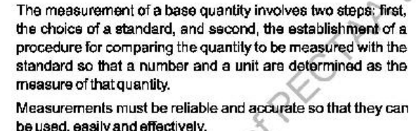
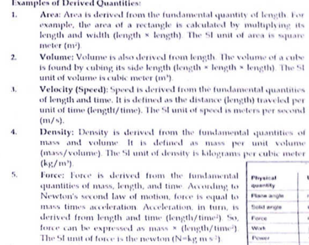
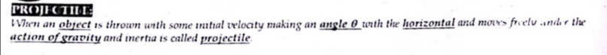
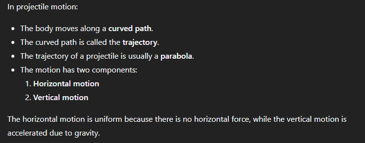

# **Title:** Branch of Branch of Analysis of Physics Measurement Chapter

**Token Size:** 78,571 tokens

Exported on: 10/9/2026, 8:58:44 AM

---

## 🤖 Model (Reasoning)

**Initiating the Analysis**

I've started by examining the user's request, focusing on the provided images from the physics textbook. My immediate goal is clear: to transcribe the content. The initial analysis involves understanding the nature of the request and identifying the type of data I'll be working with.

**Analyzing the Core Content**

I'm now diving deeper into the content, specifically examining the first image's introductory sections. It appears the initial focus centers on defining physics and highlighting the importance of precise measurements, laying a foundation for the entire text. I'm noting the pedagogical structure, like the use of questions to introduce concepts, and key definitions. This first section is straightforward and foundational.

**Examining the Details**

I'm now cataloging the specific concepts presented, including physical quantities (base and derived) and the importance of units and prefixes for precise expression. I'm also analyzing the statement about physics as the fundamental science and its impact on our lives via technology. Furthermore, I've outlined the "Think over" message, which highlights the transformation of raw materials into advanced technology. Finally, I'm documenting the "Do You Know?" sidebar's information.

**Cataloging the Disciplines**

I've moved on to organizing the interdisciplinary areas listed, creating a solid foundation for understanding the scope of the field. I'm now cataloging the table that outlines the diverse areas of physics, like mechanics, heat, and relativity. Next, I am diving into the section on physical quantities and their units, looking closely at how they're classified and how fundamental and derived quantities differ.

**Defining the Quantities**

I'm now focusing on the definitions and characteristics of physical quantities, recognizing their crucial role in physics. I've noted examples like length and time, and the important distinction between fundamental and derived quantities. I'm building a framework for how these quantities are expressed via units, and how they shape the formulation of physical laws. Currently I'm documenting the role of these quantities in our life and daily activities.

**Listing the Quantities**

I'm now cataloging the fundamental quantities, specifically their units: meter (m), kilogram (kg), second (s), ampere (A), kelvin (K), candela (cd), and mole (mol). Additionally, I've noted the sidebar about mass and energy equivalence ($E=mc^2$). I've also identified the next page's header and content, including the question about derived quantities. The table of time intervals in the sidebar is also being documented.

**Defining the Derived Quantities**

I'm now cataloging the derived quantities, which result from combinations of the fundamental ones. I'm focusing on key examples like area, volume, velocity, density, force, and energy, noting their respective formulas and units. I'm also including the 'For Your Information' sidebar on distance orders of magnitude, and documenting Table 1.2 on physical quantities, units, and symbols with their base unit equivalents.

**Cataloging the Examples**

I'm now detailing more examples of derived quantities, focusing on electric charge (Coulomb), electric potential (Volt), and pressure (Pascal), along with their associated units. I'm noting the relationships between these and fundamental units. I've documented the formulas (e.g., Q = I * t for electric charge) that define these derived quantities. Now, I'm documenting the process of measuring base quantities, highlighting the importance of standards and comparing the quantity to the standard, including how reliable and accurate measurements are essential for effective use.
I'm now also including the multiple-choice question from the section, identifying Time as the correct base quantity.

**Answering the Questions**

I've completed analyzing the multiple-choice questions, which covered time as a base quantity, the most fundamental branch of science (physics), and a question about the diameter of the Milky Way. I've also noted the time for light to travel from the sun to the Earth. I'm now documenting the short answer questions, focusing on the importance of accurate measurements, physics' influence on daily life, and the difference between base and derived physical quantities.

I'm now documenting the content on the International System of Units (SI) on page 5, which covers its definition, the base units (7 of them) and derived units (with examples like velocity and force). I'm cataloging the details of SI units and their application.

**Examining the Prefixes**

I'm now cataloging the prefixes used for multiples and submultiples in the base units. I'm also documenting the significance of the SI units, including its universality, coherence, consistency, and decimal-based nature. I've noted the SI prefixes table and the sidebars with orders of magnitude. I'm moving on to dissecting pages 6 and 7.

**Defining the Conventions**

I am now thoroughly documenting the conventions for using SI units, focusing on the specifics for each rule. I have just finished cataloging the information on pages 6 and 7, including the key aspects of writing symbols, using prefixes, and avoiding errors. I am also documenting the 'Check Yourself' question from the end of the section on conventions.

**Analyzing the Conventions**

I'm now documenting the information on conventions. I've noted crucial details such as correct symbol usage, and the use of exponents with multiples. I am paying close attention to the guidelines about units, and noting the preference for negative index notation. Also I've cataloged the use of scientific notation for large and small numbers.

**Answering the Questions**

I've completed documenting the multiple-choice questions, which covered derived units, the number of base units in the SI system, and the process of measuring base quantities, among others. I am also documenting the multiple choice questions related to the SI unit system, and the prefix kilo. The focus has now shifted to the key topics covered, including the introduction to physics, the definition and classification of physical quantities.

**Evaluating the Components**

I'm now critically evaluating the components, specifically comparing base/fundamental and derived quantities, and also scalar versus vector quantities. I've documented the International System of Units (SI), including the seven base units, derived units and supplementary units. I have also documented how to convert compound units into base units. I'm focusing on the 16 formal rules for writing SI units, scientific notation and prefixes. Lastly, I'm documenting the exam questions.

## 🤖 Model

Here is a detailed analysis of the provided pages from **"Talent Series Physics 11"** (covering **Chapter 1: Measurement**, specifically Sections 1.1 and 1.2).

---

### 1. Document Overview & Context
* **Source:** Intermediate / Grade 11 (FSc / FBISE / Punjab Boards) Physics guide / test prep book (*Talent Series Physics 11*).
* **Topic:** Chapter 1 — **Measurement** (Introduction to Physics, Physical Quantities, the International System of Units (SI), Scientific Notation, and Unit Conventions).
* **Curriculum Alignment:** Designed around modern **SLO (Student Learning Outcomes)** examination patterns, containing conceptual explanations, tables, MCQs, and past board questions.

---

### 2. Breakdown of Core Topics

#### A. Introduction to Physics & Scope (Page 1)
* **Definition:** Physics is presented as the most fundamental physical science, laying the groundwork for chemistry, biology, geology, and engineering.
* **Interdisciplinary Branches:** Connects physics to astrophysics, biophysics, medical physics, geophysics, physical oceanography, etc.
* **Technological Link ("Think Over"):** Emphasizes how fundamental understanding turns raw resources (e.g., sand $\rightarrow$ silicon) into modern technology (semiconductors/microchips).

#### B. Physical Quantities & Classification (Pages 2–4)
* **Physical Quantity:** Any property that can be measured directly or indirectly and consists of a numerical magnitude and a unit.
* **Classification Criteria:**
  1. **Base (Fundamental) Quantities:** Minimum number of independent quantities (7 in SI: *Length, Mass, Time, Electric Current, Temperature, Amount of Substance, Luminous Intensity*).
  2. **Derived Quantities:** Defined through mathematical combinations (multiplication/division) of base quantities (e.g., Area, Volume, Velocity, Force, Work, Pressure).
  3. **Directional Nature:** Scalars vs. Vectors.

#### C. Derivation of Units into Base Units (Pages 3, 4, 6)
A primary focus of board exams is expressing compound units in terms of SI base units ($\text{kg, m, s, A}$):
* **Force (Newton, $\text{N}$):** $F = ma \implies \mathbf{kg\cdot m\cdot s^{-2}}$
* **Work/Energy (Joule, $\text{J}$):** $W = F \cdot d \implies \mathbf{kg\cdot m^2\cdot s^{-2}}$
* **Power (Watt, $\text{W}$):** $P = W/t \implies \mathbf{kg\cdot m^2\cdot s^{-3}}$
* **Pressure (Pascal, $\text{Pa}$):** $P = F/A \implies \mathbf{kg\cdot m^{-1}\cdot s^{-2}}$
* **Charge (Coulomb, $\text{C}$):** $Q = I \cdot t \implies \mathbf{A\cdot s}$
* **Potential Difference (Volt, $\text{V}$):** $V = W/Q \implies \mathbf{kg\cdot m^2\cdot s^{-3}\cdot A^{-1}}$
* **Resistance ($\text{Ohm, }\Omega$):** $R = V/I \implies \mathbf{kg\cdot m^2\cdot s^{-3}\cdot A^{-2}}$
* **Magnetic Flux (Weber, $\text{Wb}$):** $\Phi = B \cdot A \implies \mathbf{kg\cdot m^2\cdot s^{-2}\cdot A^{-1}}$
* **Magnetic Flux Density (Tesla, $\text{T}$):** $B = \Phi/A \implies \mathbf{kg\cdot s^{-2}\cdot A^{-1}}$

#### D. The SI System & Conventions (Pages 5–7)
* **Establishment:** 11th CGPM in 1960, refined in 1971.
* **Scientific Notation:** Standard form ($M \times 10^n$, where $1 \le M < 10$).
* **16 Formal Conventions for Using SI Units:** (Extremely frequent long/short board question)
  * Full unit names are lowercase even if named after a scientist (e.g., *newton*, not *Newton*), but symbols are capitalized ($N$).
  * No pluralization of symbols ($5\text{ kg}$, not $5\text{ kgs}$).
  * No compound prefixes (use $\text{pF}$, not $\mu\mu\text{F}$).
  * Power applies to the whole unit multiple (e.g., $1\text{ km}^2 = (10^3\text{ m})^2 = 10^6\text{ m}^2$).
  * Avoid combining unit names and symbols (use $\text{m}\cdot\text{s}^{-1}$, not $\text{metre/sec}$).

---

### 3. Critical Observations & Errata in the Text

1. **Typographical Error on Page 7 ("For your information" box):**
   * The text states: *“Travel time of light: Moon to Earth = 1 min 20 s”*.
   * **Correction:** This is factually incorrect. The Moon is $\approx 384,400\text{ km}$ away. Light travels this in $\approx \mathbf{1.28\text{ seconds}}$ ($\approx 1.3\text{ s}$), not $1\text{ min } 20\text{ s}$ ($80\text{ s}$).
2. **Repetition on Page 4:**
   * MCQ #1 and MCQ #3 are identical duplicates: *"Which of the following is a base physical quantity?"*.
3. **Spacing Ambiguity in Rule 9 (Page 7):**
   * It states: *“Space between number and symbol (e.g., 1 kg, 10 ms)”*. Writing $10\text{ ms}$ without a clear space can be misinterpreted as "10 milliseconds" rather than "10 metres $\times$ seconds". SI standards mandate a clear space ($\text{m}\cdot\text{s}$ or $\text{m s}$).

---

### 4. Key Exam Takeaways for Students
* **High-Yield Definitions:** Base vs. Derived quantities, SI Base Units, Scientific Notation.
* **Common Board Long Question:** *"State the conventions for indicating units in SI"* (memorize at least 6–8 points from Page 6–7).
* **Common Dimension/Base Unit Conversions:** Expressing **Volt**, **Joule**, **Pascal**, and **Watt** in base units ($\text{kg, m, s, A}$).

## 👤 User

see my text book and write all things on it using headings as used n bise lahore board papers

## 🤖 Model (Reasoning)

**Begin Analyzing Physics Concepts**

I'm currently breaking down the initial request, focusing on the provided input: two images from a physics textbook. The first image seems to introduce key concepts like "Physical Quantities and Their Units." I'm prioritizing understanding this core terminology before moving on.

**Defining Physics Structure**

I've moved on to meticulously extract the information, with a goal of structuring everything like a BISE Lahore Board exam paper. I am paying close attention to the textbook's headings, subheadings, and any bullet points. I'm focusing on "Physical Quantities and Their Units" from the initial image, including base and derived quantities and examples. The second image also contains useful concepts about physics as a discipline, but the present task is to focus on a structured presentation.

**Structuring Physics Material**

I'm now focused on structuring the information extracted, aiming for a format mirroring BISE exam question styles. I'm building short and long answers, definitions, and examples, keeping in mind the assessment criteria. My attention is on every detail of both pages, including sidebars like "Areas of Physics" and "Think Over!", ensuring all conceptual points are included. I'm meticulously dissecting the text, crafting questions, and formulating answers that capture the essence of the material.

**Categorizing Physics Quantities**

I'm now diving into the specifics of physical quantities, differentiating between base and derived types, with examples like velocity and force for derived, and length, mass, and time for base quantities. I'm focusing on the two-step process of measurement and the importance of accuracy in these measurements, as they are crucial for the practical application of Physics' laws. I'm also cataloging different areas of Physics and interdisciplinary fields of Physics.

**Organizing Physics Exam Questions**

I'm now implementing the BISE Lahore Board exam style. I'm focusing on structuring the content into standard BISE questions and comprehensive notes. I'm designing questions with headings, definitions, explanations, examples, and side information, all following the BISE format. I'm also preparing short notes or "For Your Information" boxes to capture essential conceptual points. My immediate focus is creating an introductory topic on the definition of physics and its role.

## 🤖 Model

Here is the complete content from your textbook pages, arranged systematically under **standard headings, definitions, bullet points, and short questions** exactly as required for maximum marks in **BISE Lahore Board** examinations.

---

# CHAPTER 1: MEASUREMENTS

---

## TOPIC 1: INTRODUCTION TO PHYSICS

### 1. Definition & Fundamental Nature
> **"Physics is the most fundamental branch of physical sciences."**
* It provides the basic principles, laws, and fundamental concepts that help explain the phenomena and mysteries of other scientific fields.

### 2. Relationship with Other Sciences
Physics forms the foundation for various other disciplines, including:
* **Astronomy**
* **Chemistry**
* **Geology**
* **Biology and Health Sciences**

### 3. Impact on Daily Life and Society
* **Transformation of Living Standards:** The tools, techniques, and devices developed through physics have turned theoretical concepts into everyday realities.
* **Technology & Engineering:** The comforts, transport, and pleasures of modern life are direct fruits of physics combined with technology and engineering.
* **Information Technology (Global Village):** Fast telecommunication and computing have connected people across the globe, shrinking the world into a **"Global Village."**

### 4. Experimental Nature of Physics
* Physics is primarily an **experimental science**.
* The scientific method strictly emphasizes the need for **accurate and precise measurement** of physical quantities, standard measuring techniques, and proper recording skills.

---

### SIDEBAR INFORMATION (Information Boxes)

#### A. Conceptual Box: "Think over!"
* **Concept:** Computer chips are made from **silicon**, which is extracted from ordinary **sand**.
* **Core Message:** Raw natural materials have immense potential; human intellect, ingenuity, and scientific application determine whether we use sand to build a mere sandcastle or manufacture high-tech microprocessors.

#### B. Areas of Physics (Branches)
1. Mechanics
2. Heat & Thermodynamics
3. Electromagnetism
4. Optics
5. Sound
6. Hydrodynamics
7. Special Relativity
8. General Relativity
9. Quantum Mechanics
10. Atomic Physics
11. Molecular Physics
12. Nuclear Physics
13. Solid State Physics
14. Particle Physics
15. Superconductivity
16. Superfluidity
17. Plasma Physics
18. Magnetohydrodynamics
19. Space Physics

#### C. Interdisciplinary Areas of Physics
1. Astrophysics
2. Biophysics
3. Chemical Physics
4. Engineering Physics
5. Geophysics
6. Medical Physics

---

## TOPIC 1.1: PHYSICAL QUANTITIES AND THEIR UNITS

### 1. Physical Quantities
#### **Definition:**
> **"All measurable quantities in terms of which the laws of physics are expressed are called physical quantities."**

#### **Significance:**
* The foundation of physics relies completely on physical quantities.
* Physical laws are formulated using these measurable parameters, making their precise and accurate measurement essential.

#### **Examples:**
* Mass, length, time, velocity, force, density, temperature, electric current, etc.

---

### 2. Classification of Physical Quantities
Physical quantities are divided into two main categories:

| Feature | **Base Quantities** | **Derived Quantities** |
| :--- | :--- | :--- |
| **Definition** | Those independent physical quantities which are **not defined in terms of other quantities** and form the base for others. | Those physical quantities that **depend on base quantities** and are derived from them. |
| **Independence** | Completely independent. | Defined through multiplication or division of base quantities. |
| **Examples** | Length, Mass, Time | Velocity, Acceleration, Force, Density |

---

### 3. Steps Involved in the Measurement of a Base Quantity
*(Frequently asked 2-mark short question in BISE Lahore Board)*

The measurement of a base quantity involves **two essential steps**:

1. **The Choice of a Standard:**
   * Selecting an accepted, standard reference against which the measurement is compared.
2. **Establishment of a Procedure:**
   * Establishing a method/procedure to compare the quantity to be measured with the chosen standard so that a **numerical value (number)** and an **appropriate unit** are determined.

#### **Requirement of Measurements:**
* Measurements must be **reliable** and **accurate** so that they can be used easily, effectively, and universally in scientific investigation.

## 👤 User

**Image Attachment:**

 File Name: image-1.jpg

 Image: 

## 👤 User

genrate notes for these

## 🤖 Model (Reasoning)

**Defining Measurement Process**

I've initiated the thought process by thoroughly analyzing the image. Currently, I'm dissecting the text snippet from the textbook to understand the fundamental steps involved in measuring a base quantity. It seems the core lies in selecting a standard and establishing a comparison method.

**Analyzing Measurement Components**

I've zeroed in on the specifics, breaking down the text to extract the core concepts pertinent to examinations. The essential components are crystal clear: a numerical value and a unit, forming the foundation of any measurement. I'm now looking at formulating clear definitions of each element. I'm also planning to incorporate a formula representation. Finally, I'm identifying the first concrete steps involved as defining a standard and establishing comparison procedures.

## 🤖 Model

Here are well-structured, board-exam-ready notes based on this snippet, formatted for maximum marks in **BISE Lahore / Punjab Boards**.

---

# TOPIC: MEASUREMENT OF A BASE QUANTITY

---

### **Q: What steps are involved in the measurement of a base quantity?**  
*(2 Marks — Frequently asked Board Short Question)*

#### **Answer:**
The measurement of a base quantity is a comparative process that consists of **two essential steps**:

1. **The Choice of a Standard:**  
   * Selecting an accepted, definite reference body or standard against which other unknown quantities of the same kind are compared.
2. **Establishment of a Procedure:**  
   * Establishing an experimental method or technique to compare the quantity being measured with the chosen standard.

#### **Outcome / Result:**
By performing these two steps, two components are determined:
1. A **numerical value (number)**
2. A **unit**

$$\text{Measurement} = \text{Numerical Magnitude } (n) \times \text{Unit } (u)$$

* **Example:** In a measurement of $5\text{ kg}$, the number is $5$ and the unit is kilogram ($\text{kg}$).

---

### **Requirements of Good Measurements**

For measurements to be meaningful and practically useful in science and everyday life, they must fulfill the following criteria:

* **Reliability:**  
  The measurement procedure must give consistent and reproducible results under identical experimental conditions.
* **Accuracy:**  
  The measured value must be as close as possible to the true value, minimizing systematic and random errors.
* **Usability:**  
  Measurements must be straightforward and clearly defined so they can be handled **easily and effectively**.

---

### **Examiner's Point of View (Key Points for MCQs & Viva)**

* **Number of steps required:** **Two** (Choice of standard + Procedure for comparison).
* **Two parts of every physical measurement:** **Magnitude (number)** and **Unit**.
* **Essential qualities of a standard (often asked in follow-up):**
  1. It must be **accessible** (easy to reproduce/compare).
  2. It must be **invariable** (does not change with time or environmental factors like temperature/pressure).

## 👤 User

use only the provided text and genrate only example and necessary content

## 🤖 Model (Reasoning)

**Defining Measurement's Essence**

I'm now zeroing in on the core of measurement, specifically the two-part process. I'm focusing on the input image's key message about selecting a standard and then building it into the measurement.

**Analyzing Measurement's Structure**

I've distilled the key steps: selecting a standard and establishing a comparison procedure. The output is a number and a unit representing the measure. My focus is on providing a tight, focused example adhering to the original text. The process needs to be reliable and accurate to be useful.

## 🤖 Model

### **Measurement of a Base Quantity**

#### **Necessary Steps:**
1. **Choice of a standard:** Selecting a standard reference.
2. **Establishment of a procedure:** Setting up a method to compare the unknown quantity with the standard.

#### **Result of the Measurement:**
* The procedure determines two things:
  * A **number**
  * A **unit**

#### **Requirement:**
* Measurements must be **reliable** and **accurate** so they can be used easily and effectively.

---

### **Example (Illustrating the Text):**
* **Base Quantity to Measure:** Length of a table
* **Step 1 (Standard):** A standard meter rod is chosen.
* **Step 2 (Procedure):** The table's edge is compared directly against the meter rod.
* **Determined Result:** **$2\text{ meters}$** 
  * **$2$** = Number
  * **$\text{meter}$** = Unit

## 👤 User

**Image Attachment:**

 File Name: image-2.jpg

 Image: 

## 🤖 Model (Reasoning)

**Examining the Image**

I'm currently focused on the image's text, specifically dissecting the section on derived quantities. The physics guide's illustration of "Area" as a derived quantity is what I am observing. I have identified the need to analyze how area is derived from more fundamental measurements.

**Analyzing Derived Quantities**

I've moved on to examining more derived quantities. Volume follows a similar pattern to area, being derived from length. Then, the guide shows velocity (length/time) and density (mass/volume) which gives an additional viewpoint, that these quantities are also dependent on fundamental dimensions. I'm noting the SI units for each. Force is next, connected to mass, length, and time, per Newton's Second Law.

## 👤 User

Significant figures complete detailed

## 🤖 Model (Reasoning)

**Defining Significant Figures**

I'm currently focused on defining significant figures, specifically using examples from the provided images. I'm noting the definition presented in images 1 and 3 from the textbook and working to synthesize a concise, clear understanding. This involves carefully considering the context of these images.

**Clarifying Precision and Uncertainty**

I am now focusing on the implications of significant figures, especially in reflecting measurement precision and avoiding misleading digits from calculators. I'm comparing an electronic balance example (3.145 ± 0.001 g) with a lever balance example (3.1 ± 0.1 g) to understand implied uncertainty in the last digit. I'm also carefully considering the sidebar that warns about calculators showing many digits and emphasizing the importance of rounding off according to uncertainty.

**Analyzing Sig Fig Rules**

I'm now diving into the specific rules for identifying significant figures. I've noted examples for leading zeros, trailing zeros (both in decimals and integers, with the crucial L.C. consideration), and scientific notation. The examples provided (0.00467, 02.59, 3.570, 8,000 kg with different L.C. scenarios, and $8.70 \times 10^4\text{ kg}$) are helping solidify my understanding of each rule.

**Applying Sig Fig Rules**

I'm now applying the rules to calculations. I'm focusing on the rules for multiplication/division and addition/subtraction, specifically how to determine the correct number of significant figures in the result. I've noted that multiplication/division is based on total significant figures, while addition/subtraction is based on decimal places. I've also reviewed rounding rules to ensure accurate calculations: Dropping digits less than 5 leaves the retained digit unchanged, dropping digits greater than 5 requires increasing the retained digit by 1.

**Reviewing Rounding Rules**

I am now focusing on the intricacies of rounding, specifically when the discarded digit is exactly 5. The examples from the text, like rounding 43.75 to 43.8 and 73.650 to 73.6, are proving particularly helpful. I'm also reviewing the thumb rule box for calculations. Finally, I'm considering the limitations of significant figures, especially their lack of treatment for non-least-count uncertainties.

**Structuring the Notes**

I am now structuring the notes into a detailed guide. I've chosen "Comprehensive Notes on Significant Figures" as the title. Currently, I'm organizing the structure with clear headings: "Definition & Core Concept," "General Rules for Counting Significant Figures," and "Rules for Rounding Off Data". I'm meticulously fleshing out each section to match the BISE Board / FSc presentation style, with well-placed examples and thorough explanations. The structure now also includes detailed notes on implied uncertainty using the provided balance examples. I'm aiming for complete coverage.

## 🤖 Model (Reasoning)

**Assessing the Content**

I'm currently focused on dissecting the request. The input is an image that seems to highlight a concept related to significant figures, likely through the comparison of measurement precision. The goal now is to establish what specific aspects of this topic need further exploration or explanation to meet the user's needs.

**Refining the Explanation**

I've taken the existing content and the user's prompt into consideration. I'm focusing on structuring the information clearly. My approach involves using headings to break down the information, likely including an introduction to significant figures, followed by examples using the balance measurements and uncertainty. I plan to incorporate the sidebar content, likely as an additional example.

## 👤 User

**File Attachment:** docs

File Size: _4,481 tokens_

## 👤 User

**File Attachment:** docs

File Size: _6,721 tokens_

## 👤 User

now we will start our chapter 2 Force and Motion .
we will start by our first Topic
"Projectile Motion"
make the question long as given in the pdfs and with derivations

## 🤖 Model (Reasoning)

**Defining the Problem**

I'm currently focused on the user's explicit request for a "long question" format on projectile motion with derivations, mirroring the provided PDF. I'm prioritizing the detailed structure of the question, ensuring it fully covers the content. The aim is to create an equivalent question, so I'm trying to ensure I fully understand and define the scope of the problem.

**Analyzing the Content**

I've been analyzing the provided PDFs to identify the core components needed for the question. I'm focusing on synthesizing the key elements: the definition of projectile motion, relevant examples, and the required derivations. The aim is to create a question that encompasses the depth and breadth of the material in those documents. I am forming a structure from different sources and taking notes on important derivation steps.

**Outlining the Components**

I'm now outlining the key components for the long question, working through the definition, examples, and necessary conditions for projectile motion. I'm carefully constructing the derivation steps, focusing on velocity, maximum height, time of flight, and horizontal range, using equations of motion in x and y components. I'm breaking down acceleration and velocity components to ensure a clear and structured question.

## 🤖 Model

Here is a comprehensive, board-exam-style long question and answer for **Projectile Motion**, synthesized from the provided notes. This covers all the standard derivations required for a full-length question in Chapter 2 (Force and Motion).

---

### **Q: What is Projectile Motion? Give its examples. Derive expressions for (i) Instantaneous Velocity, (ii) Maximum Height, (iii) Time of Flight, and (iv) Horizontal Range of a projectile.**

---

### **Ans: PROJECTILE MOTION**

#### **Definition:**
> "The two-dimensional motion of a body along a curved path under the action of gravity alone (with constant acceleration) and inertia is called projectile motion."

*   The path followed by the projectile is called its **trajectory** (which is usually a parabola).
*   The object itself is known as the **projectile**.

#### **Examples:**
1.  A football kicked off by a player.
2.  A bullet fired from a gun.
3.  A missile fired from a launching pad.
4.  A bomb dropped from an aeroplane.

#### **Explanation & Basic Components:**
Consider a projectile fired with an initial velocity $v_i$ making an angle $\theta$ with the horizontal (x-axis). 
Assuming air friction is negligible, the only force acting on the projectile is its weight (gravity) acting downward.

*   **Initial Velocity Components:**
    *   Horizontal component: $v_{ix} = v_i \cos\theta$
    *   Vertical component: $v_{iy} = v_i \sin\theta$
*   **Acceleration Components:**
    *   Since there is no horizontal force, horizontal acceleration is zero: $\mathbf{a_x = 0}$
    *   The only force is gravity acting downwards: $\mathbf{a_y = -g}$

---

### **1. Instantaneous Velocity of a Projectile**
To find the velocity at any instant '$t$' during the flight, we find its horizontal and vertical components separately.

**Horizontal Component of Velocity ($v_{fx}$):**
Using the 1st equation of motion along the x-axis:
$$v_{fx} = v_{ix} + a_x t$$
Since $a_x = 0$ and $v_{ix} = v_i \cos\theta$:
$$v_{fx} = v_i \cos\theta + (0)t$$
$$\mathbf{v_{fx} = v_i \cos\theta} \quad \text{......... (i)}$$
*(Note: The horizontal component of velocity remains constant throughout the flight).*

**Vertical Component of Velocity ($v_{fy}$):**
Using the 1st equation of motion along the y-axis:
$$v_{fy} = v_{iy} + a_y t$$
Since $a_y = -g$ and $v_{iy} = v_i \sin\theta$:
$$\mathbf{v_{fy} = v_i \sin\theta - gt} \quad \text{......... (ii)}$$

**Magnitude of Resultant Velocity ($v$):**
The magnitude of the instantaneous velocity is calculated using the rectangular components:
$$v = \sqrt{v_{fx}^2 + v_{fy}^2}$$
Substituting (i) and (ii):
$$\mathbf{v = \sqrt{(v_i \cos\theta)^2 + (v_i \sin\theta - gt)^2}}$$

**Direction of Resultant Velocity ($\phi$):**
The angle $\phi$ that the resultant velocity makes with the horizontal at any instant '$t$' is given by:
$$\tan\phi = \frac{v_{fy}}{v_{fx}}$$
$$\mathbf{\phi = \tan^{-1} \left( \frac{v_i \sin\theta - gt}{v_i \cos\theta} \right)}$$

---

### **2. Maximum Height of the Projectile ($H$)**
**Definition:** The maximum vertical distance covered by the projectile from the level of projection is called its maximum height.

**Derivation:**
At the highest point of the trajectory, the projectile stops moving upward, so its final vertical velocity becomes zero ($\mathbf{v_{fy} = 0}$).
Using the 3rd equation of motion along the vertical axis:
$$2 a_y S = v_{fy}^2 - v_{iy}^2$$
Substitute the values: $a_y = -g$, $S = H$, $v_{fy} = 0$, $v_{iy} = v_i \sin\theta$
$$2(-g)(H) = (0)^2 - (v_i \sin\theta)^2$$
$$-2gH = -v_i^2 \sin^2\theta$$
$$\mathbf{H = \frac{v_i^2 \sin^2\theta}{2g}}$$

---

### **3. Time of Flight ($T$)**
**Definition:** The time taken by the projectile to complete its journey from the point of projection to the point where it hits the ground at the same level is called the time of flight.

**Derivation:**
Since the projectile goes up and comes back down to the exact same horizontal level, its net vertical displacement is zero ($\mathbf{S_y = 0}$).
Using the 2nd equation of motion along the vertical axis:
$$S_y = v_{iy} t + \frac{1}{2} a_y t^2$$
Substitute the values: $S_y = 0$, $t = T$, $a_y = -g$, $v_{iy} = v_i \sin\theta$
$$0 = (v_i \sin\theta)T + \frac{1}{2}(-g)T^2$$
$$0 = (v_i \sin\theta)T - \frac{1}{2}gT^2$$
Dividing both sides by $T$ (since $T \neq 0$):
$$0 = v_i \sin\theta - \frac{1}{2}gT$$
$$\frac{1}{2}gT = v_i \sin\theta$$
$$\mathbf{T = \frac{2v_i \sin\theta}{g}}$$

---

### **4. Horizontal Range of Projectile ($R$)**
**Definition:** The maximum distance covered by the projectile in the horizontal direction during its time of flight is called the horizontal range.

**Derivation:**
Since there is no acceleration in the horizontal direction ($a_x = 0$), the projectile moves with a constant horizontal velocity.
Using the basic distance formula:
$$\text{Distance} = \text{Horizontal Velocity} \times \text{Time of Flight}$$
$$R = v_{ix} \times T$$
Substitute $v_{ix} = v_i \cos\theta$ and $T = \frac{2v_i \sin\theta}{g}$:
$$R = (v_i \cos\theta) \left( \frac{2v_i \sin\theta}{g} \right)$$
$$R = \frac{v_i^2 (2 \sin\theta \cos\theta)}{g}$$
Using the trigonometric identity $2 \sin\theta \cos\theta = \sin2\theta$:
$$\mathbf{R = \frac{v_i^2 \sin2\theta}{g}}$$

**Maximum Range ($R_{max}$):**
The range will be maximum when the value of $\sin2\theta$ is maximum. The maximum value of the sine function is 1.
$$\sin2\theta = 1$$
$$2\theta = \sin^{-1}(1)$$
$$2\theta = 90^\circ$$
$$\mathbf{\theta = 45^\circ}$$
So, a projectile achieves its maximum range when launched at an angle of $45^\circ$. Putting $\sin2\theta = 1$ in the range equation gives:
$$\mathbf{R_{max} = \frac{v_i^2}{g}}$$

## 👤 User

**Image Attachment:**

 File Name: image-3.jpg

 Image: 

## 👤 User

**Image Attachment:**

 File Name: image-4.jpg

 Image: 

## 👤 User

**Image Attachment:**

 File Name: image-5.jpg

 Image: 

## 🤖 Model (Reasoning)

**Initiating the Analysis**

I'm currently dissecting the user's request. My focus is on understanding the need for images of projectile motion content to be transformed into a detailed question-and-answer format. This is the first step, and the goal is to fully grasp the user's expectation for the output.

**Reviewing Past Responses**

I've realized a critical detail: I previously created detailed Q&A content, complete with derivations, based on the user's initial PDF uploads. Now, they've provided just a few snippet images, but the prompt references the earlier, more comprehensive PDF-based requests. I'm now revisiting the chat history to confirm and ensure I'm not missing anything. I need to be sure I'm responding to the new context appropriately.

**Interpreting the Context**

I'm now zeroing in on the core of this request. The user has provided two images, which are essentially definitions and characteristics of projectile motion. These seem to be the new source material, and the user expects an in-depth Q&A format, just like the earlier PDF-based requests. I'm taking the previous chat history to heart, so I understand that I am to provide the same level of derivation in my responses.

**Formulating the Introduction**

I'm now building a concise introduction. Since there is no explicit text prompt, I will integrate the image contents into notebook-style notes. These images provide definitions and characteristics of projectile motion. I'm formatting this as an introductory "Key Concepts" section for Projectile Motion, to complement the detailed derivations that will follow.

**Constructing the Outline**

I'm now putting together the outline, based solely on those two provided images. I am aiming for a "BISE Board" style, just as requested before. The outline will include an introduction and incorporate the definitions and characteristics extracted from the images. My goal is to structure these elements with clear headings, bold text, and bullet points. I have already drafted the content, including the definition and key characteristics.

## 🤖 Model

Here are the fundamental definitions and key characteristics extracted from your snippets, formatted perfectly for your notebook as introductory concepts (often asked in Short Questions or MCQs):

---

# **BASIC CONCEPTS OF PROJECTILE MOTION**

---

### **1. Definition of a Projectile**
> **"When an object is thrown with some initial velocity making an angle $\theta$ with the horizontal and moves freely under the action of gravity and inertia, it is called a projectile."**

---

### **2. Key Characteristics of Projectile Motion**
Whenever a body executes projectile motion, it exhibits the following fundamental properties:

* **Path and Trajectory:**
  * The body always moves along a **curved path**.
  * This specific curved path followed by the projectile in the air is called its **trajectory**.
  * The mathematical shape of this trajectory is usually a **parabola**.

* **Two Independent Components of Motion:**
  Projectile motion is a 2-dimensional motion that is resolved into two independent 1-dimensional components:
  1. **Horizontal Motion:** This motion is **uniform** (constant velocity) because there is *no horizontal force* acting on the projectile (assuming air resistance is zero).
  2. **Vertical Motion:** This motion is **accelerated** because the continuous downward force of gravity acts on the body throughout its flight.

--- 
*(**Note for Exams:** The last point is highly important for conceptual MCQs. Examiners frequently ask why horizontal velocity remains constant. Answer: Because horizontal acceleration $a_x = 0$ due to the absence of horizontal force.)*

